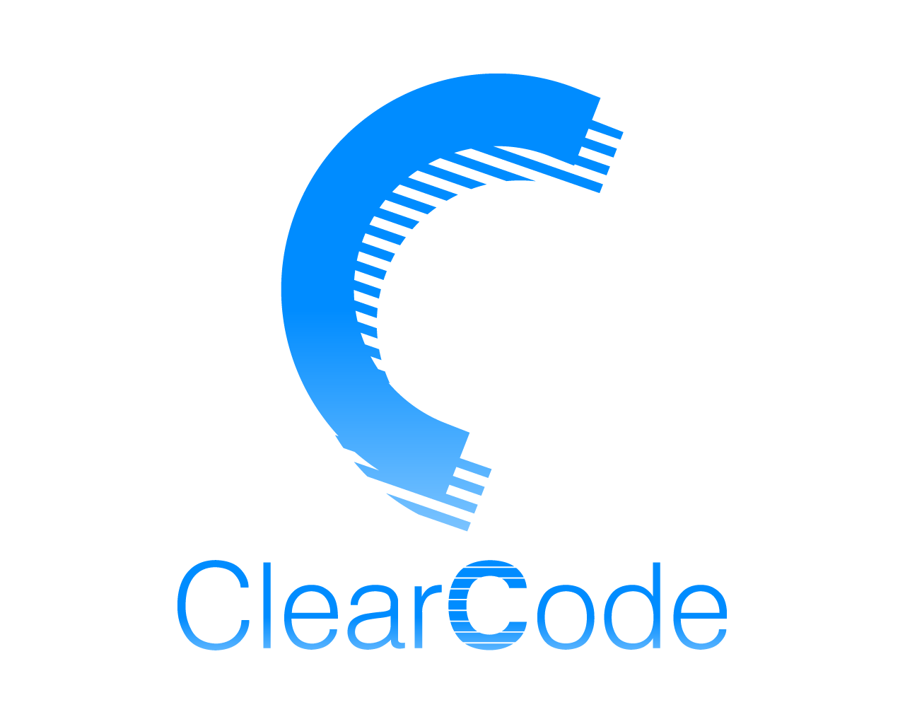
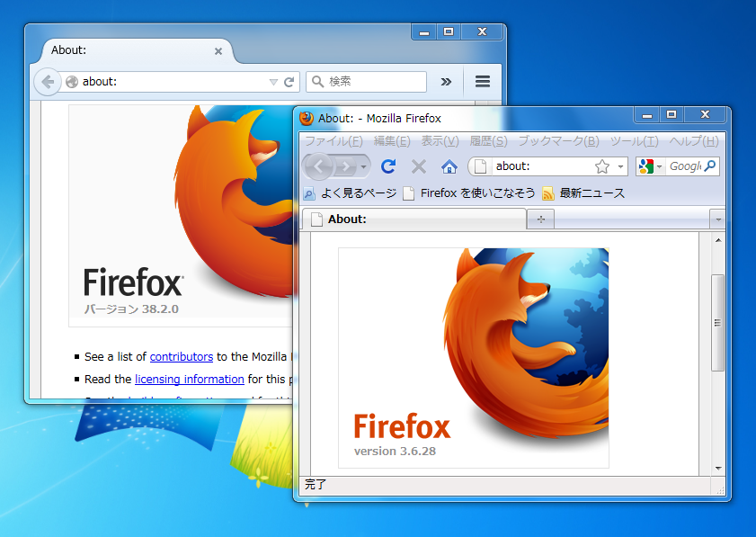

# 法人利用におけるFirefox

subtitle
:   　　
    ～ カスタマイズから集中管理まで ～

author
:   結城洋志

institution
:   株式会社クリアコード

allotted_time
:   50m

theme
:   clear-code


{::comment}


# 株式会社クリアコード

{:relative_height="100"}

# 株式会社クリアコード

概要

{:relative_height="100"}

# 株式会社クリアコード

主な事業内容

{:relative_height="100"}

# 株式会社クリアコード

主な事業内容

{:relative_height="100"}


# 株式会社クリアコード

Mozillaサポート

{:relative_height="100"}

{:/comment}


# Mozilla Firefoxとは？

{:relative_height="100"}

{::comment}
Firefoxのスクリーンショットは
http://www.mozilla.jp/press/#sec-kits
より引用
{:/comment}


# Mozilla Firefoxとは？

{:relative_width="40" align="right" relative_margin_right="-10"}

Netscape Communicator 5.0
のソースコード（1998年公開）
に由来

 * 一部のコードや
   データ形式は
   引き継がれている
 * オープンソースという言葉の発祥

{::comment}
画像は
https://commons.wikimedia.org/wiki/File:Netscape_Communicator_4.8_Screenshot.png
より引用
{:/comment}

# Mozilla Firefoxとは？

{:relative_width="35" align="right" relative_margin_right="-10"}

 * Netscapeから独立し
   「Mozilla」ブランドを確立
 * Webブラウザ単体の
   製品として再設計
   * Eメールクライアント
     →Thunderbird
   * 統合アプリケーション
     →Seamonkey

{::comment}
画像は
https://commons.wikimedia.org/wiki/File:Phoenix_0.1.png
より引用
{:/comment}

# オープンな開発体制

{:relative_width="42" align="right" relative_margin_right="-10"}

 * Mozilla雇用の
   フルタイム開発者
 * 一般の開発者
   * ボランティア
   * 企業の被雇用者

# オープンな開発体制

{:relative_width="32" align="right" relative_margin_right="-10"}

 * スローガンは
   [「インターネット上の
   オープン性と革新、
   機会を促進すること」 ](https://www.mozilla.org/ja/mission/)
   * 増収増益は*目的*でない
   * 「目的達成のためには
     一定のシェアが必要」
     という立場から普及を促進

# リリースサイクル

通常版と長期サポート版の2ライン

{:relative_height="100"}

{::comment}
画像は
http://www.mozilla.jp/business/downloads/
より引用
{:/comment}

# リリースサイクル

通常版
:   * サポート期間は6〜8週間

長期サポート版（*ESR版*）
:   * 主に企業利用を想定
    * サポート期間は約1年、
      通常リリースと同期して
      セキュリティアップデート

# どこで使われている？

 * 生命保険・損害保険
 * 電力会社
 * 中央官庁

その他、様々な企業で利用実績あり

# なぜ使われる？

 * 現在利用中のシステムを
   維持したままで
 * 自由に導入・削除ができて
 * 最新のWeb技術に対応している

**「ちょうどいい」選択肢**
として重宝されている

# 代表的な導入の動機

事例1
:   SaaSを利用したい
    （サービスがモダンなWebブラウザを要求）

     * *Office 365*
     * Google Apps
     * Salesforce

# 代表的な導入の動機

事例2
:   古いInternet Explorerに依存した
    社内システムの更新が間に合わない
    
     * IEは社内ネットワーク用に限定
     * インターネットはFirefoxで利用

# 導入までの流れ（例）

 * 仕様検討
   * 運用中のIEと同様の管理について相談
   * IEとFirefoxの使い分けなど、
     要件を満たすカスタマイズの提案
   * おすすめ設定の提示
 * α版、β版提供
 * 正式版提供、全社展開


# 保守/メンテナンスでの関わり

 * バージョンアップへの対応
 * トラブル発生時の対応
   * ソースコードの調査まで含めた
     原因究明と回避策の提案
   * 問題を暫定的に回避するアドオンの提供
   * 場合によってはMozilla Japanと連携

{::comment}
このスライドは外す？
{:/comment}


# 法人利用で便利な特性

{:relative_height="100"}

# Firefoxの特徴

カスタマイズ性が*非常に高い*
:   * できる事の幅が広い
    * ともすれば途方に暮れがち
    * *指針*を元に考えよう

# IEの運用の延長線上で

 * IEでは○○していた
 * IEでは○○できた

→これを手がかりに考える
:   * 実際にやっている・やっていた事は
      イメージしやすい

# 頻出カスタマイズ例

{:relative_height="100"}


# 例：機能の制御

 * 自動アップデートを禁止したい
 * アドオンを利用させたくない

→*アドオン*を使用
:   * Disable Auto-update
    * Disable Addons

# 例：プライバシー情報の制御

 * パスワードを保存させたくない
 * 位置情報を提供させたくない

→*MCD*を使用
:   * `lockPref("signon.rememberSignons",
                false);`
    * `lockPref("geo.enabled", false);`

# 例：通信量の削減

 * バックグラウンドで行われる
   不要な通信をすべて禁止したい

→*MCD*を使用
:   * `lockPref("geo.wifi.uri", "");`
    * `lockPref("loop.enabled", false);`

# 例：プラグインの制御

 * プラグインを強制的に有効化/無効化したい

→*アドオン*を使用
:   * Force Addon Status

# 例：UIの制御

 * 特定のメニュー項目を隠したい
 * 特定のキーボードショートカットを
   無効化したい

→*アドオン*を使用
:   * globalChrome.css
    * UI Text Overrider

# 例：設定の集中管理

 * 設定を変更させたくない
 * グループポリシーのように
   組織全体で設定を一括管理したい

→*MCD*を使用
:   * `lockPref("設定キー", "値");`

{::comment}

# 設定の集中管理

*Mission Control Desktop*（*MCD*）
:   * Netscape Mission Control Desktop
      に由来
    * 設定ファイルで*設定をロック*
    * *リモート設定ファイル*で集中管理

# 設定の集中管理の例

~~~
lockPref("browser.startup.homepage", "http://...");

lockPref("media.eme.enabled",false);
lockPref("media.gmp-gmpopenh264.enabled",false);
lockPref("media.gmp-eme-adobe.enabled",false);
lockPref("media.gmp-provider.enabled",false);

lockPref("browser.formfill.enable", false);
lockPref("signon.rememberSignons", false);

if (typeof getPref("toolkit.telemetry.prompted") == "boolean")
  clearPref("toolkit.telemetry.prompted");
lockPref("toolkit.telemetry.prompted", 2);
lockPref("toolkit.telemetry.rejected", true);
lockPref("toolkit.telemetry.enabled", false);
lockPref("toolkit.telemetry.infoURL", ");
lockPref("toolkit.telemetry.server", ");
~~~
{: lang="javascript"}


{:/comment}


# 管理者による設定の強制

{:relative_height="60"}

Firefoxの実行ファイルと同じ
フォルダにある設定ファイルを参照

# グループポリシーのような運用

{:relative_height="75"}

サーバー上にある設定ファイルを参照


# 例：インスタンスの使い分け

 * 「組織内システム用」と
   「通常用」を使い分けたい
 * サポートセンターで
   「業務システムの閲覧用」と
   「お客様の環境の再現用」を
   使い分けたい
 * 特定Webサイト用ビューワーとして使いたい


# 例：インスタンスの使い分け

{:relative_width="40" align="right" relative_margin_right="-10"}

→*専用プロファイル*の使用
:   * 複数バージョン共存
    * 複数プロセスを
      並行起動
    
    ```
    > "C:\Program Files (x86)\Mozilla Firefox\firefox.exe"
        -no-remote -profile "C:\Path\To\Profile"
    ```

# その他様々なカスタマイズ

 * SQLite DBを自動的にVACUUMさせたい
 * 特定のタブだけをアイドル時に
   再読み込みさせたい

→*アドオン*を開発
:   * Places Auto Vacuum On Idle
    * Reload on Idle


# 例：一斉展開

 * カスタマイズ済みのFirefoxを
   一斉展開したい

→*メタインストーラ*を使用
:   * Firefox本体をサイレントインストール
    * カスタマイズを反映
    * 詳細は[www.clear-code.com/blog/2012/11/7](http://www.clear-code.com/blog/2012/11/7.html)を参照


# メタインストーラの動作

{:relative_height="75"}

カスタマイズを自動的に反映


# まずはここから

{:relative_width="100"}

# カスタマイズメニュー

{:relative_width="45" align="right" relative_margin_right="-10"}

各種カスタマイズ項目の*メニュー*

 * 何ができる？
 * どんな選択肢
   がある？

実際の導入事例の
頻出設定パターン集

→*ご希望の方に随時ご提供します*


# 法人向けFAQ

{:relative_width="35" align="right" relative_margin_right="-10"}

[mozilla.jp/business/faq/tech/](http://mozilla.jp/business/faq/tech/)
([github.com/mozilla-japan/enterprise](https://github.com/mozilla-japan/enterprise/))

 * ○○を無効化したい
 * ○○を使いたい

*公開中*

# サポートサービスのご案内

株式会社クリアコード
:   * [www.clear-code.com](http://www.clear-code.com)
    * Mozilla Japanサポートパートナー
    * Firefox/Thunderbird
      インシデントサポート

{::comment}
このスライドは外す？
{:/comment}
